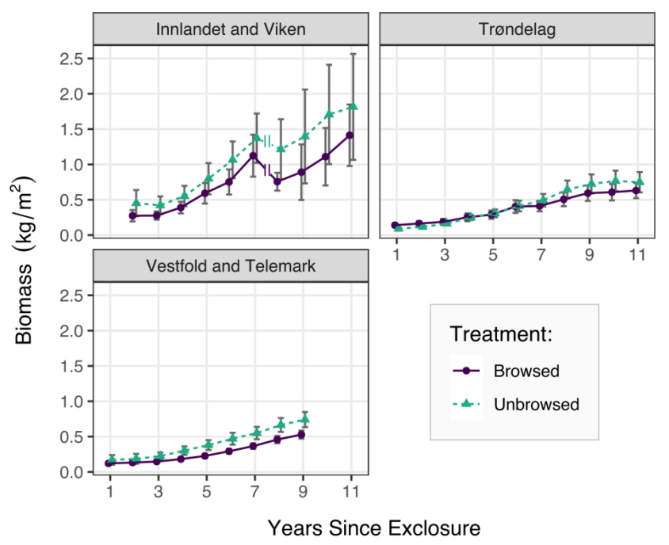
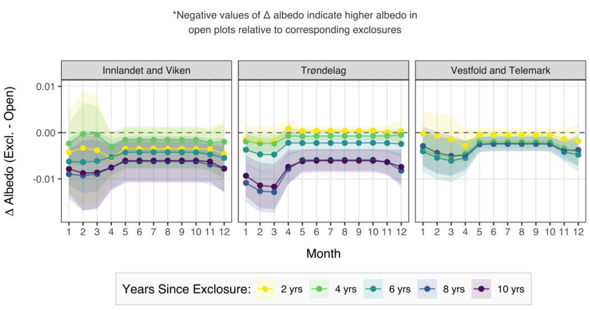

# mooseclimate
John Salisbury - NTNU Master's Thesis Project (2019-2021)

## How does moose herbivory affect carbon and albedo dynamics in successional boreal forest?

This is the GitHub repo for my two-year master's thesis project. It is a subset of NTNU's SustHerb project, which seeks to explore the role of large herbivores in Norwegian forest dynamics. In this project, I used R in combination with large spatiotemporal ecological and climate datasets to assess the impacts of selective moose herbivory on forest surface albedo, carbon dynamics, and climate forcing in successional Norwegian boreal forests. In addition to processing and cleaning large datasets, I used statistical methods such as linear mixed effects models to test hypotheses, ultimately determining that moose have a measurable impact on carbon and albedo dynamics.

---
### [View Full Thesis](https://ntnuopen.ntnu.no/ntnu-xmlui/handle/11250/2824273)
---

## Exclosure component:
An analysis of aboveground tree biomass, surface albedo, and climate forcing across 10 years of forest herbivore exclosure in 44 study sites across Norway. 

**Data**:
* Spatiotemporal dataset of tree species, diameter-at-ground-level (cm), and height (cm) - *provided by SustHerb project at NTNU*
* Spatiotemporal snow water-equivalent (SWE) and temperature (K) observations at each study site - *provided by SeNorge (Norwegian Meteorological Institute)*
* Spatiotemporal large herbivore density data (vector data) for all municipalities in Norway - *provided by SustHerb project at NTNU*

**Key Methods**:
* Biomass calculations done using locally-calibrated biomass models by [Kolstad et al. (2018)](https://link.springer.com/article/10.1007/s10021-017-0202-4)
* Albedo estimates made using non-linear albedo models developed by [Hu et al. (2018)](https://agupubs.onlinelibrary.wiley.com/doi/full/10.1029/2018MS001403)
* Net climate forcing estimates made by NTNU Department of Industrial Ecology using methods adapted from [Cherubini et al. (2018)](https://www.tandfonline.com/doi/abs/10.1080/1747423X.2018.1529831?journalCode=tlus20)

**Key Results**:

Total aboveground tree biomass (kg m-3) within open plots and moose exclosures
in the years after initial exclosure, averaged within each study region. Error bars represent
standard error. Few study sites in Innlandet and Viken had data past seven years since
exclosure.

---

Mean difference in albedo between moose exclosures and open plots, where
difference equals exclosure albedo minus open plot albedo. Differences are averaged
within each study region. Line colors correspond to number of years since exclosure, while
shading indicates standard error. Horizontal dashed line indicates no difference in albedo.
Negative values indicate higher albedo in open plots relative to exclosures.

---

Effect of moose exclosure on annual CO2-equivalents (kg CO2-eq. m-2) at 44 study
sites in Norway, averaged by region. Positive values indicate that exclosure has a warming
climate effect equivalent to more CO2 in the atmosphere. Negative values indicate that
exclosure has a cooling effect equivalent to less CO2 in the atmosphere. Green lines
represent climate changes due to differences in aboveground carbon between exclosures
and open plots. Blue lines represent climate changes due to differences in albedo. Orange
lines indicate the net climate impact of moose exclosure. Shading represents standard
error.

---